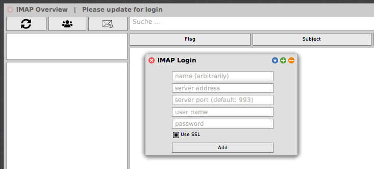
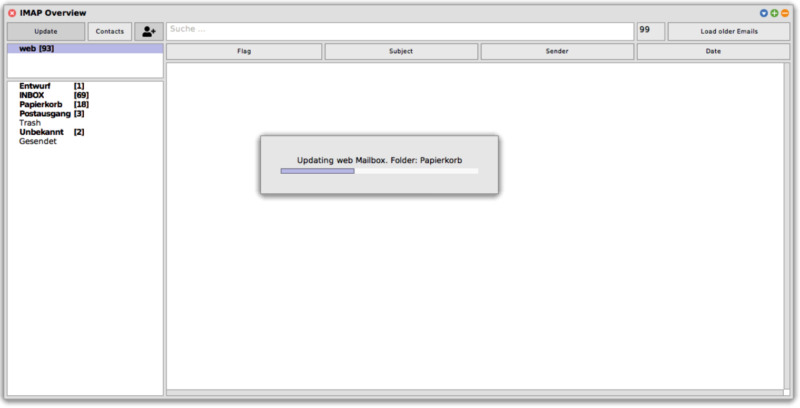
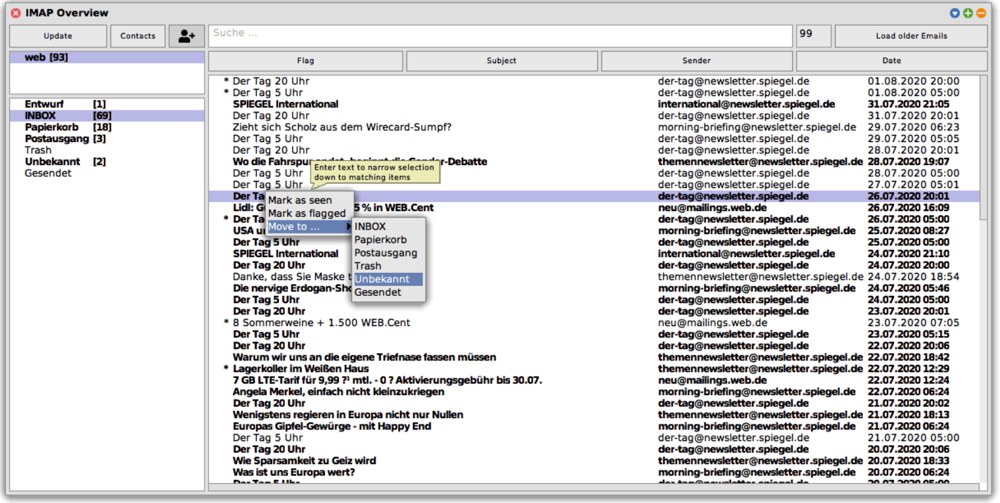
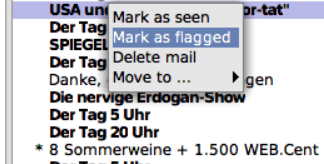
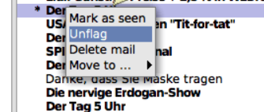
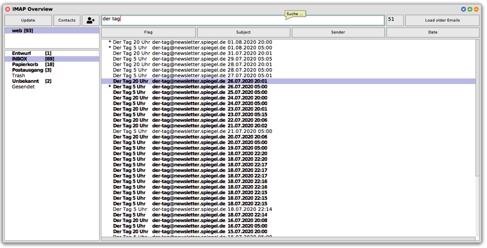
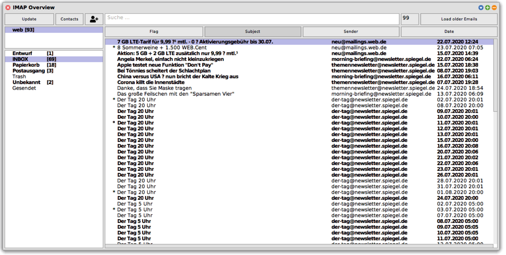
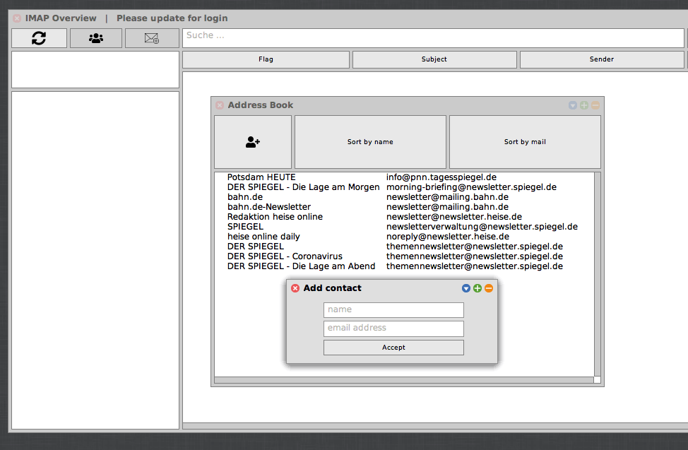

# IMAPClient [](https://travis-ci.org/hpi-swa-teaching/IMAPClient) [](https://coveralls.io/github/hpi-swa-teaching/IMAPClient?branch=develop)
 
Welcome to our IMAP Client project. We are a team of 4th semester IT-Systems Engineering students and are happy to take over this project for the sixth iteration.
This project is part of a lecture in Softwareengineering techniques and will be contributing to our final grade, so we are giving it our best ;)
As this is a student project, it will mostly be worked on during the summer terms. Therefore our time with this project is limited to the end of july.

In case of any questions, feel free to contact us.
 
## Installation
1. Get [Squeak 5.2 or later](http://www.squeak.org)
2. Load [Metacello](https://github.com/metacello/metacello)
3. Finally, load the package with the following command:

```
Metacello new
  baseline: 'IMAPClient';
  repository: 'github://hpi-swa-teaching/IMAPClient:develop/packages';
  load.
```

4. Now you can setup a Menu Entry under "Apps" using `ICFolderDialog install`.


## Open
You can open the tool with the command `ICFolderDialog new` or using a Menu Entry.

 ## Configuration
 You can customize the number of mails, which are fetched on the initial update process, and the number of mails which are loaded if you press the `Load older Mails` Button. Default are 100 and 10. Change `ICFolder>>numbersOfHeadersToFetch{AtLoaderOlderMail | AtTheBeginning}`
 This will not regard the e-mails that are already persisted on your disk, so if you have some e-mails in a Maildir directory, all of them will be read no matter what you defined here.
 
 ## Features
 - Manage different accounts
  
  You can add an account by clicking the `+` button. You will then be prompted to enter the account information needed to establish a connection with the server.
  When you have a lot of eamils, this step might take a while, because after initialization you will be greeted with all your recent emails already fetched for you to see.
  
 - Fetch new mails from the server
  
  Mails are automatically fetched on login. If you wish to update and resynchronize with the server, click the update button.
  
 - Delete & move mails
 
 A right click on any mail will show you your options. Deleting a mail automatically moves it to the trash folder. If you want to revert a deletion, you can simply navigate to the trash folder and move the email back to another folder.
 When you want to permanently delete emails, right click on the trash folder and choose expunge. This will dump your trash folder permanently.
 
 - Flag and read emails
  A right click on any mail will show you your options. You can flag an email for later use or mark it as seen if you do not want to be disturbed by it beeing highlighted anymore. Also you can mark already seen mails as unseen again.
  
  
    
 - See unseen mails immediately. 
 All unseen mails will be highlighted and the number of unseen mails per folder can be seen next to the folder name.
 
 - Search Mails
  
  You can enter a search string into the search bar at the top. Right next to the search bar you can see, how many search results you got for the current search.
 
 - Parse different encodings
 
 - Reflect server changes back to Client. 
 If you're accessing your mails for a different device, and deleting/moving them, just press the update button in the Client, and every change should be correctly updated.
 
 - Sort mails by different categories. 
   
 By default all sortings are ascending. Double clicking the button will switch do descending order.
 
 - Addressbook. 
   
 You can open the addressbook by clicking the button with the person icon. The adressbook holds all sender addresses of mails from any of the currently logged in accounts.

## Usage
Start the IMAP Client with `ICFolderDialog new`. Add new Accounts with the `+` Button. We tested the functionality with web.de Accounts. But other accounts should work fine.
The hpi owa accounts are known to be relatively large, as calendar and contact meta information is also sent to our client as folder objects. Therefore it might not entirely load in the requested time of 5 seconds.

For HPI accounts use the following login info:
``` 
Server: owa.hpi.de
Port: 993
Username: surname.lastname
Password: xxxxxxx
Use SSL: True
```
For web.de accounts use the following login info:
``` 
Server: imap.web.de
Port: 993
Username: username
Password: xxxxxxx
Use SSL: True
```

## Security
Your password isn't stored on disk, but will be visible to your Squeak environment. It is immediately deleted after login, so you will not be able to retrieve it afterwards, but be aware that we are no security experts and you might not want to test this with a high severity account.
After closing the IMAP-Client and reopening it your are welcomed by a password prompt to re-enter your credentials.

## Known Problems

As this project has lived through many iterations, there are a couple of known issues that we could not resolve during the few months we spend with this project. 
If you encounter any problem while using our IMAP client, have a look at the Issues of this GitHub Project. Most of them are probably already known to us.
In case your problem has not been reported yet, feel free to post a new issue and describe what you dis to get the problem, what the unexpected behaviour was and what behaviour you would have expected. 
Thank you in anvance for contributing to making this project better by reporting any problems that we are not yet aware of!

## Documentation

Hava a look at the GitHub Project Wiki to find more insights into the project.

## History
2016: Johannes Schneider, Maximilian Söchting, Julian Weise, Alexander Riese, Alexander Loeser

2017: Jonathan Sauder, Marcus Ding, Melvin Witte, Daniel Lindner

2018: Claudia Grabowski, Leonard Von Merzljak, Marius Walter, David Hennemann

2019: Paul Methfessel, Martin Taraz, Otto Kissig, Tim Garrels, Felix Rindt

2020: Henrik Guhl, Lorenz Woth, Niko Hastrich, Julia Joch
